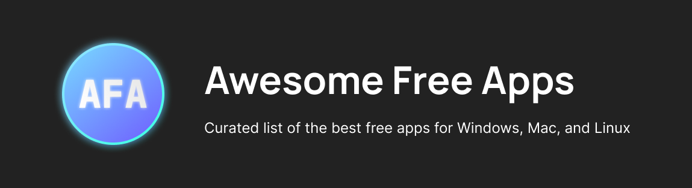

    

<a href="windows-only.md">Windows Only</a> — <a href="macOS-only.md">macOS Only</a> — <a href="linux-only.md">Linux Only</a> — <a href="open-source-only.md">Open-source Only</a> — <a href="recommended-only.md">Recommended Only</a>

| Icon | Meaning              | Icon | Meaning              |
|------|----------------------|------|----------------------|
| 🪟   | Available on Windows | 🟢   | Open-source          |
| 🍎   | Available on macOS   | ⭐   | Recommended by us    |
| 🐧   | Available on Linux   |      |                      |

> [!IMPORTANT]
> Maintaining this project requires a lot of time. [Donate to support me!](https://patreon.com/axorax) ❤️
>
> [Discord server](https://discord.gg/nKUFghjXQu) — [Patreon](https://patreon.com/axorax)

## Contents

- [Audio](#audio)
    - [Audio Players](#audio-players)
    - [Audio Recording](#audio-recording)
    - [DJ Software](#dj-software)
    - [Music Notation](#music-notation)
    - [Music Production](#music-production)
- [Browsers](#browsers)
- [Communication](#communication)
    - [Messaging](#messaging)
    - [Email Clients](#email-clients)
- [Compression and Archiving](#compression-and-archiving)
- [Customize](#customize)
    - [System Customization](#system-customization)
    - [Wallpaper Tools](#wallpaper-tools)
- [Data Management](#data-management)
    - [Copy and Move](#copy-and-move)
    - [Sync and Clone](#sync-and-clone)
- [Developer Tools](#developer-tools)
    - [API Development](#api-development)
    - [Database](#database)
    - [Network Analysis](#network-analysis)
    - [Game Engines](#game-engines)
    - [Virtualization](#virtualization)
- [Documents](#documents)
    - [Office Suites](#office-suites)
    - [E-book](#e-book)
    - [PDF Tools](#pdf-tools)
- [Note taking](#note-taking)
- [Text Editors](#text-editors)
- [Download Managers](#download-managers)
- [Games](#games)
    - [Cloud Gaming](#cloud-gaming)
    - [Mobile Emulators](#mobile-emulators)
    - [Other Emulators](#other-emulators)
- [Graphics Tools](#graphics-tools)
- [3D Modeling and Animation](#3d-modeling-and-animation)
- [Security](#security)
    - [Antivirus](#antivirus)
    - [Password Managers](#password-managers)
- [Image Viewers](#image-viewers)
- [Remote Access](#remote-access)
- [Video](#video)
    - [Video Editors](#video-editors)
    - [Video Players](#video-players)
    - [Video Streaming and Recording](#video-streaming-and-recording)
    - [Video Converters and Compressors](#video-converters-and-compressors)
- [VPN and Proxy Tools](#vpn-and-proxy-tools)
- [Utility](#utility)
    - [Clipboard Management](#clipboard-management)
    - [Metadata](#metadata)
    - [Window Management](#window-management)
    - [File Management](#file-management)
    - [Screenshot](#screenshot)
    - [Space Visualizer](#space-visualizer)

## Audio

- [JACK Audio](https://jackaudio.org/) - Audio server for routing and mixing sound between programs. 🪟 🍎 🐧

### Audio Players

- [Foobar2000](https://foobar2000.org/) - Lightweight and highly customizable audio player with support for many formats. 🪟 🍎 ⭐
- [Strawberry Music Player](https://strawberrymusicplayer.org/) - Music player for organizing and playing your audio collection. 🪟 🍎 🐧

### Audio Recording

- [Audacity](https://audacityteam.org/download/) - Audio editor for recording and editing sounds. 🪟 🍎 🐧 🟢 ⭐
- [Ocenaudio](https://ocenaudio.com/) - Easy-to-use audio editor for recording and analyzing sounds. 🪟 🍎 🐧

### DJ Software

- [Mixxx](https://mixxx.org/) - DJ software for live mixing and beatmatching with controller support. 🪟 🍎 🐧
- [VirtualDJ](https://virtualdj.com/) - DJ platform for mixing music, beatmatching, and live performance. 🪟 🍎
- [Serato DJ Lite](https://serato.com/dj/lite) - DJ software for beginners to mix music with ease. 🪟 🍎
- [Rekordbox](https://rekordbox.com/en/) - Software that enables a comfortable DJ workflow with AI, cloud, and automation tech. 🪟 🍎

### Music Notation

- [MuseScore](https://musescore.org/) - Software for creating, playing, and sharing sheet music. 🪟 🍎 🐧
- [LilyPond](http://lilypond.org/) - Music notation program for creating high-quality sheet music. 🪟 🍎 🐧
- [Frescobaldi](https://frescobaldi.org/) - Editor for LilyPond to create music scores quickly. 🪟 🍎 🐧
- [ABCjs](https://abcjs.net/) - Tool for writing and playing ABC music notation. 🪟 🍎 🐧
- [Denemo](https://denemo.org/) - Music notation software for fast score creation with LilyPond. 🪟 🍎 🐧

### Music Production

- [LMMS](https://lmms.io/) - DAW for creating music with virtual instruments and MIDI support. 🪟 🍎 🐧 🟢 ⭐
- [Ardour](https://ardour.org/) - DAW for recording, editing, and mixing audio with professional features. 🪟 🍎 🐧
- [Tracktion T7](https://tracktion.com/products/t7-daw) - DAW for music production with advanced editing features. 🪟 🍎 🐧
- [Zrythm](https://zrythm.org/) - DAW for music production with an easy-to-use interface. 🪟 🍎 🐧
- [Stargate DAW](https://github.com/stargatedaw/stargate) - Innovation-first DAW, instrument and effect plugins. 🪟 🍎 🐧 🟢

## Browsers

- [Arc](https://arc.net) - Vertical tab browser for modern productivity. 🪟 🍎
- [Brave](https://brave.com/) - Privacy-focused and fast browser. 🪟 🍎 🐧
- [Chrome](https://google.com/chrome/) - Fast browser with integrated Google services. 🪟 🍎 🐧
- [Chromium](https://chromium.org/Home) - Browser project behind Chrome. 🪟 🍎 🐧 🟢
- [ungoogled-chromium](https://github.com/ungoogled-software/ungoogled-chromium) - Privacy-focused Chromium with Google services removed. 🪟 🍎 🐧 🟢
- [Firefox](https://mozilla.org/en-US/firefox/) - Browser with privacy and customization. 🪟 🍎 🐧 🟢
- [LibreWolf](https://librewolf.net) - Privacy-focused Firefox fork with enhanced security. 🪟 🍎 🐧
- [Microsoft Edge](https://microsoft.com/edge) - Chromium-based browser with extra enhancements. 🪟 🍎 🐧
- [Min](https://minbrowser.org/) - Fast, minimal browser prioritizing privacy. 🪟 🍎 🐧
- [Opera](https://opera.com) - Browser with built-in ad-blocking, VPN, and speed. 🪟 🍎 🐧
- [Pale Moon](https://palemoon.org/) - Goanna-based browser. 🪟 🍎 🐧 🟢
- [Orion](https://browser.kagi.com/) - Lightweight WebKit browser with Chrome/Firefox extension support. 🍎 🐧
- [qutebrowser](https://qutebrowser.org/) - Keyboard-driven, vim-like browser in Python and Qt. 🪟 🍎 🐧
- [Safari](https://apple.com/safari/) - Native Mac browser with Apple device integration. 🍎
- [Station](https://getstation.com/) - Browser centralizing web apps in one workspace. 🪟 🍎 🐧
- [Tor Browser](https://torproject.org/projects/torbrowser.html) - Privacy browser routing traffic over the Tor network. 🪟 🍎 🐧 ⭐
- [Mullvad Browser](https://mullvad.net/en/download/browser/) - Privacy browser with Tor, anti-fingerprinting, and Mullvad VPN. 🪟 🍎 🐧
- [Vivaldi](https://vivaldi.com) - Customizable browser putting you in control. 🪟 🍎 🐧
- [Yandex](https://browser.yandex.com/) - Fast, secure browser by Yandex with privacy features. 🪟 🍎 🐧
- [Zen Browser](https://zen-browser.app/) - Beautifully designed, privacy-focused browser with custom mods. 🪟 🍎 🐧

## Communication

### Messaging

- [Discord](https://discord.com/) - Communication platform for text, voice, and video, popular with gamers. 🪟 🍎 🐧 ⭐
- [Telegram](https://telegram.org/) - Cloud-based messaging app known for speed, security, and group chats. 🪟 🍎 🐧
- [WhatsApp](https://whatsapp.com/) - Free messaging app with text, voice, video calls, and multimedia sharing. 🪟 🍎
- [Signal](https://signal.org/) - Secure, private messaging app with end-to-end encryption. 🪟 🍎 🐧
- [Slack](https://slack.com/) - Collaboration hub for teams with messaging, file sharing, and integrations. 🪟 🍎 🐧
- [Viber](https://viber.com/) - Free messaging app with text, voice, video calls, and file sharing. 🪟 🍎 🐧
- [Microsoft Teams](https://microsoft.com/en-us/microsoft-teams/group-chat-software) - Team communication platform with chat, file sharing, and video conferencing. 🪟 🍎 🐧
- [Skype](https://skype.com/) - Messaging and video call service supporting text, voice, and video. 🪟 🍎 🐧

### Email Clients

- [CanaryMail](https://canarymail.io/) - Secure email app with PGP support and AI assistance. 🍎 🐧
- [ElectronMail](https://github.com/vladimiry/ElectronMail) - Electron-based desktop client for ProtonMail. 🪟 🍎 🐧 🟢
- [Foxmail](http://www.foxmail.com/mac/en) - Fast, user-friendly email client. 🍎 🐧
- [Mailspring](https://getmailspring.com/) - Beautiful, fast email client. 🪟 🍎 🐧 🟢
- [BlueMail](https://bluemail.me/desktop/) - Cross-platform email client with modern interface. 🪟 🍎 🐧
- [Nylas Mail](https://nylas.com/nylas-mail/) - Extensible desktop email app based on web technologies. 🪟 🍎 🐧
- [Postbox](https://postbox-inc.com/) - Advanced email management with productivity focus. 🪟 🍎
- [Polymail](https://polymail.io/) - Simple, powerful email client with modern features. 🪟 🍎 🐧
- [Spark](https://sparkmailapp.com/) - Fast email client with team collaboration features. 🍎 🐧
- [ThunderBird](https://thunderbird.net/) - Email client for easier management. 🪟 🍎 🐧 🟢
- [Tutanota](https://tutanota.com/) - Encrypted email service focused on privacy. 🪟 🍎 🐧
- [Edison Mail](https://mail.edison.tech/mac) - Customizable, intuitive email client with smart features. 🪟 🍎 🐧
- [Skiff Mail](https://skiff.com/mail) - Encrypted, decentralized email service. 🪟 🍎 🐧

## Compression and Archiving

- [Keka](https://keka.io) - Archive manager supporting ZIP, 7Z, TAR, GZIP, and RAR. 🍎
- [muCommander](http://www.mucommander.com) - Lightweight dual-pane file manager with archive support. 🍎
- [The Unarchiver](https://theunarchiver.com/) - Simple tool for extracting ZIP, RAR, ISO, and other formats. 🍎
- [Unarchive One](https://cleanerone.trendmicro.com/unarchiver-one/?utm_source=github&utm_medium=referral&utm_campaign=githubproject) - Multi-format decompression tool with QuickLook integration. 🍎
- [PDF Archiver](https://github.com/JulianKahnert/PDF-Archiver) - Tool for tagging and organizing PDFs on macOS. 🍎 🟢

## Customize

### System Customization

- [Hidden Bar](https://github.com/dwarvesf/hidden) - Simple app to organize and declutter your menu bar. 🍎 🟢
- [TinkerTool](https://bresink.com/osx/TinkerTool.html) - Utility for enabling hidden system preferences. 🍎
- [MacPilot](https://koingosw.com/products/macpilot/) - Unlock hidden settings and system tweaks. 🍎

### Wallpaper Tools

- [Plash](https://sindresorhus.com/plash) - App to set websites as wallpapers. 🍎 🟢

## Data Management

### Copy and Move

- [TeraCopy](https://codesector.com/teracopy) - Copy and move multiple files. 🪟 🍎

### Sync and Clone

- [FreeFileSync](https://freefilesync.org/) - Tool for comparing and syncing files or folders. 🪟 🍎 🐧 🟢
- [Syncthing](https://github.com/syncthing/syncthing) - Continuous file synchronization for multiple computers. 🪟 🍎 🐧 🟢
- [rclone](https://rclone.org/) - Command-line tool for managing and syncing files with cloud storage. 🪟 🍎 🐧

## Developer Tools

- [Meld](https://meldmerge.org/) - Tool for visual file, directory, and version control comparison. 🪟 🍎 🐧 🟢
- [TkForge](https://github.com/Axorax/tkforge) - Drag & drop in Figma to create a Python GUI with ease. 🪟 🍎 🐧 🟢 ⭐

### API Development  

- [Postman](https://postman.com/) - API development platform with advanced testing and collaboration tools. 🪟 🍎 🐧 ⭐
- [Insomnia](https://insomnia.rest/) - Simple API client for REST and GraphQL development. 🪟 🍎 🐧 🟢 ⭐
- [Hoppscotch](https://hoppscotch.io/) - Lightweight API development tool for designing, testing, and debugging. 🪟 🍎 🐧
- [SoapUI Open Source](https://soapui.org/open-source/) - For testing REST and SOAP APIs with scripting support. 🪟 🍎 🐧 🟢
- [Cocoa Rest Client](https://mmattozzi.github.io/cocoa-rest-client/) - Native app for testing REST APIs. 🍎
- [Paw](https://paw.cloud/) - Advanced HTTP client designed for macOS. 🍎
- [Katalon Studio](https://katalon.com/) - Testing automation for APIs, web, and mobile apps. 🍎
- [HTTPie](https://httpie.io/) - Command-line and GUI tool to simplify working with APIs. 🪟 🍎
- [Mockoon](https://mockoon.com/) - Desktop tool for creating and testing mock REST APIs. 🪟 🍎 🐧

### Database

- [DBeaver](https://dbeaver.io/) - Universal database tool for SQL databases like MySQL, MariaDB, PostgreSQL, SQLite, Apache Family, and more. 🪟 🍎 🐧
- [Beekeeper Studio](https://beekeeperstudio.io/) - Modern, lightweight SQL client supporting MySQL, Postgres, SQLite, SQL Server, etc. 🪟 🍎 🐧

### Network Analysis  

- [Wireshark](https://wireshark.org/) - Leading tool for capturing and analyzing network traffic. 🪟 🍎 🐧 ⭐
- [Charles](https://charlesproxy.com/) - Debugging proxy to view HTTP and HTTPS traffic. 🪟 🍎
- [James](https://github.com/james-proxy/james) - Proxy for intercepting HTTP/HTTPS requests. 🪟 🍎 🟢
- [mitmproxy](https://mitmproxy.org/) - Interactive HTTP proxy for debugging and penetration testing. 🪟 🍎 🐧
- [Proxie](https://proxie.app/) - HTTP debugging proxy for tracking requests. 🍎
- [Proxyman](https://proxyman.io/) - Modern HTTP proxy with an intuitive UI. 🍎
- [Sniffnet](https://sniffnet.net/) - Tool for monitoring and analyzing network traffic. 🪟 🍎 🐧
- [Burp Suite Community Edition](https://portswigger.net/burp/communitydownload) - Class-leading vulnerability scanning and web app security. 🪟 🍎 🐧

### Game Engines

- [Godot](https://godotengine.org/) - Game engine for 2D and 3D games with an easy-to-learn scripting language. 🪟 🍎 🐧 🟢 ⭐
- [Unreal Engine](https://unrealengine.com/) - Powerful, fully-featured game engine for high-quality 3D games. 🪟 🍎 🐧 ⭐
- [Unity](https://unity.com/) - Popular game engine for creating both 2D and 3D games, with an intuitive interface and wide asset store. 🪟 🍎 🐧
- [GDevelop](https://gdevelop.io/) - No-code engine for creating 2D games with a visual event system. 🪟 🍎 🐧
- [Cocos2d](https://cocos.com/en/) - Game engine for mobile and web games, focused on 2D games. 🪟 🍎 🐧 🟢
- [Defold](https://defold.com/) - Cross-platform 2D game engine with easy-to-use tools. 🪟 🍎 🐧
- [Amazon Lumberyard](https://aws.amazon.com/lumberyard/) - Free, cross-platform 3D game engine integrated with AWS and Twitch for multiplayer games. 🪟 🍎
- [LÖVE](https://love2d.org/) - Simple, easy-to-learn 2D game engine for Lua. 🪟 🍎 🐧
- [Monogame](https://monogame.net/) - Framework for cross-platform game development with C#. 🪟 🍎 🐧 🟢
- [Ren'Py](https://renpy.org/) - Popular engine for creating visual novels with a simple scripting language. 🪟 🍎 🐧
- [PICO-8](https://lexaloffle.com/pico-8.php) - Fantasy console for making retro-style small games. 🪟 🍎 🐧
- [Tiled](https://mapeditor.org/) - Level editor for creating tile-based game maps, used with other engines. 🪟 🍎 🐧 🟢
- [OpenRA](https://openra.net/) - Game engine for real-time strategy games, supporting mods for classic titles. 🪟 🍎 🐧 🟢
- [AppGameKit](https://appgamekit.com/) - Flexible game engine for 2D and 3D games with simple scripting. 🪟 🍎 🐧
- [Scirra Construct](https://construct.net/) - Powerful game engine with drag-and-drop and visual scripting for 2D games. 🪟 🍎 🐧
- [Flixel](https://flixel.org/) - 2D engine built with Haxe, suitable for platformers and action games. 🪟 🍎 🐧 🟢
- [Gosu](https://libgosu.org/) - Simple 2D game development library for Ruby or C++. 🪟 🍎 🐧
- [Roblox Studio](https://create.roblox.com/) - Engine for making games on Roblox. 🪟 🍎

### Virtualization

- [Docker](https://docker.com/) - Containerization platform for operating-system-level virtualization. 🪟 🍎 🐧 🟢 ⭐
- [Multipass](https://multipass.run/) - Quickly launch and manage Ubuntu virtual machines on demand. 🪟 🍎 🐧
- [OrbStack](https://orbstack.dev/) - Lightweight and fast virtualization for running Docker containers and Linux machines. 🍎
- [Lima](https://github.com/lima-vm/lima) - Tool for launching Linux VMs with file sharing and port forwarding. 🍎 🟢
- [QEMU](https://qemu.org/) - Emulator and virtualizer for hardware and system virtualization. 🪟 🍎 🐧 🟢
- [UTM](https://mac.getutm.app/) - GUI for QEMU to run various VMs including ARM64 and x64. 🍎
- [Vagrant](https://vagrantup.com) - Tool for managing reproducible development environments using virtual machines. 🪟 🍎 🐧 🟢
- [Rancher Desktop](https://rancherdesktop.io) - App for managing containers and Kubernetes on desktop. 🪟 🍎 🐧 🟢
- [Podman Desktop](https://podman.io/) - Desktop alternative to Docker for managing containers. 🪟 🍎 🐧
- [VirtualBox](http://www.virtualbox.org) - Virtualization software for creating and managing virtual machines. 🪟 🍎 🐧
- [VMWare Workstation](https://vmware.com/products/desktop-hypervisor/workstation-and-fusion) - Virtualization software with advanced features. 🪟 🍎 🐧

## Documents

### Office Suites
- [LibreOffice](https://libreoffice.org/) - Popular and easy to use office suite. 🪟 🍎 🐧 🟢 ⭐
- [OnlyOffice](https://onlyoffice.com/) - Office suite with collaboration features. 🪟 🍎 🐧 🟢
- [Apache OpenOffice](https://openoffice.org/) - Suite for documents, spreadsheets, etc. 🪟 🍎 🐧 🟢
- [Calligra Suite](https://calligra.org/) - Office suite with word processing and vector graphics. 🪟 🍎 🐧
- [WPS Office](https://wps.com/) - Lightweight office suite compatible with MS file formats. 🪟 🍎 🐧
- [FreeOffice](https://freeoffice.com/) - Suite with compatibility for MS Office formats. 🪟 🍎 🐧
- [Etherpad](https://etherpad.org/) - Real-time collaborative text editor. 🪟 🍎 🐧
- [Google Workspace](https://workspace.google.com/) - Cloud-based suite for document collaboration. 🪟 🍎 🐧
- [Collabora Online](https://collaboraoffice.com/) - Cloud-based LibreOffice for collaboration. 🪟 🍎 🐧

### E-book
- [Calibre](https://calibre-ebook.com/) - Powerful e-book manager. 🪟 🍎 🐧
- [iChm](https://github.com/NSGod/ichm) - CHM reader. 🍎 🟢
- [Kindle App](https://amazon.com/l/16571048011) - Official Kindle reader app. 🪟 🍎
- [Klib](http://klib.me/) - Manage Kindle and iBooks highlights. 🍎
- [Koodo Reader](https://koodoreader.com/en) - EBook reader supporting 15+ formats. 🪟 🍎 🐧
- [Readest](https://github.com/chrox/readest) - Cross-platform eBook reader with tools. 🪟 🍎 🐧 🟢
- [Scribus](https://scribus.net/) - Layout and publishing software. 🪟 🍎 🐧 🟢
- [Sigil](https://sigil-ebook.com/) - EPUB editor. 🪟 🍎 🐧 🟢
- [Simple Comic](https://apps.apple.com/us/app/simple-comic/id1497435571?mt=12) - Reader for PDF, CBZ, and CBR formats. 🍎
- [Naps2](https://naps2.com/) - Scan documents to PDF and more, as simply as possible. 🪟 🍎 🐧 🟢

### PDF Tools
- [Okular](https://okular.kde.org/) - Universal document viewer by KDE. 🪟 🍎 🐧
- [Skim](https://skim-app.sourceforge.io/) - PDF viewer for annotation. 🍎
- [Xournal++](https://xournalpp.github.io/) - Handwriting and annotation tool for PDFs. 🪟 🍎 🐧

## Note Taking

- [Obsidian](https://obsidian.md/) - Knowledge base app with powerful linking and markdown support. 🪟 🍎 🐧
- [Notion](https://notion.so/) - All-in-one workspace for notes, tasks, databases, and collaboration. 🪟 🍎 🐧
- [Plain Text Editor](https://sindresorhus.com/plain-text-editor) - Simple, distraction-free text editor for quick note-taking. 🍎  
- [Tot](https://tot.rocks/) - Simple, elegant app for collecting and editing text snippets. 🍎  
- [Craft Docs](https://craft.do/) - Beautiful and powerful tool for creating and organizing documents and notes. 🪟 🍎
- [RemNote](https://remnote.io/) - Knowledge management app with note-taking and spaced repetition features. 🪟 🍎 🐧
- [Simplenote](https://simplenote.com/) - Minimalist note-taking app that syncs across devices. 🪟 🍎 🐧
- [Joplin](https://joplinapp.org/) - Capture your thoughts and securely access them from any device. 🪟 🍎 🐧 🟢

## Text Editors

- [Visual Studio Code](https://code.visualstudio.com/) - Powerful and extensible code editor developed by Microsoft, featuring debugging, version control, and support for numerous languages. 🪟 🍎 🐧 🟢
- [Atom](https://atom.io/) - Hackable text editor with features like Git integration and an extensive plugin ecosystem. 🪟 🍎 🐧 🟢
- [Vim](https://vim.org/) - Highly configurable, command-line-based text editor that is especially favored by developers for its efficiency. 🪟 🍎 🐧 🟢
- [Emacs](https://gnu.org/software/emacs/) - Powerful, extensible text editor with a broad range of features and customization options. 🪟 🍎 🐧 🟢
- [Geany](https://geany.org/) - Lightweight, fast text editor that supports many programming languages, with a built-in terminal and project management features. 🪟 🍎 🐧
- [Brackets](http://brackets.io/) - Text editor focused on web development, with live preview and preprocessor support. 🪟 🍎 🐧 🟢
- [Bluefish](https://bluefish.openoffice.org/) - Powerful text editor targeted at web developers, supporting various programming languages. 🪟 🍎 🐧
- [Aurora Editor](https://auroraeditor.com/) - Lightweight, fast code editor for macOS with a modern interface. 🍎
- [CodeEdit](https://codeedit.app/) - Lightweight native code editor for macOS. 🍎 🟢
- [CotEditor](https://coteditor.com) - Lightweight plain-text editor designed for macOS. 🍎
- [Haystack Editor](https://github.com/haystackeditor/haystack-editor) - Code editor with a canvas UI for better code understanding. 🪟 🍎 🐧 🟢
- [Helix](https://helix-editor.com/) - Post-modern modal text editor with extensibility and performance. 🪟 🍎 🐧
- [Lapce](https://lapce.dev/) - Fast, powerful code editor designed for modern workflows. 🪟 🍎 🐧
- [LightTable](http://lighttable.com/) - Next-generation code editor focused on instant feedback. 🪟 🍎 🐧
- [micro](https://micro-editor.github.io) - Modern, intuitive terminal-based text editor. 🪟 🍎 🐧
- [Neovim](https://github.com/neovim/neovim) - Modern, extensible terminal-based code editor. 🪟 🍎 🐧 🟢
- [Nova](https://nova.app/) - Fast, flexible, and beautiful native Mac code editor from Panic. 🍎
- [Sublime Text](http://www.sublimetext.com/3) - Popular, sleek editor with a plugin ecosystem for developers. 🪟 🍎 🐧
- [SubEthaEdit](https://subethaedit.net/) - Collaborative text editor that allows real-time editing. 🍎
- [TextMate](https://macromates.com) - Versatile, flexible text editor for macOS with advanced features. 🍎
- [Vimr](http://vimr.org/) - Refined Vim experience designed for macOS. 🍎
- [Zed](https://zed.dev/) - High-performance, multiplayer code editor from the creators of Atom. 🪟 🍎 🐧

### Download Managers

- [Free Download Manager](https://freedownloadmanager.org/) - Modern download accelerator. 🪟 🍎 🐧 ⭐
- [JDownloader](https://jdownloader.org/) - Popular download manager. 🪟 🍎 🐧 🟢  
- [Xtreme Download Manager (XDM)](https://xtremedownloadmanager.com/) - Powerful tool to increase download speed. 🪟 🍎 🐧 🟢 
- [Aria2](https://aria2.github.io/) - Lightweight, command-line download utility supporting multiple protocols. 🪟 🍎 🐧 🟢  
- [Motrix](https://motrix.app/) - Simple and clean download manager with cross-platform support. 🪟 🍎 🐧 🟢  
- [Persepolis Download Manager](https://persepolisdm.github.io/) - GUI for Aria2, providing an intuitive interface. 🪟 🍎 🐧 🟢

### Games
- [Steam](https://store.steampowered.com/) - Platform for buying and playing PC games. 🪟 🍎 🐧 ⭐
- [Epic Games Store](https://epicgames.com/store/en-US/) - Platform for exclusive and free games. 🪟 🍎
- [Ubisoft Connect](https://ubisoftconnect.com/) - Game launcher for Ubisoft titles. 🪟 🍎
- [GOG Galaxy](https://gog.com/galaxy) - DRM-free games and library management. 🪟 🍎
- [Battle.net](https://blizzard.com/en-us/apps/battle.net/desktop) - Platform for Blizzard games. 🪟 🍎
- [Origin](https://origin.com/) - EA game launcher. 🪟 🍎
- [Itch.io](https://itch.io/app) - Marketplace for indie games. 🪟 🍎 🐧
- [Riot Client](https://riotgames.com/en) - Launcher for League of Legends and more. 🪟 🍎
- [Porting Kit](https://portingkit.com/) - Install Windows games on Mac. 🍎

### Cloud Gaming  

- [NVIDIA GeForce NOW](https://nvidia.com/en-us/geforce-now/) - Free tier for streaming supported games from the cloud. 🪟 🍎 🐧
- [Xbox Cloud Gaming](https://xbox.com/en-US/play) - Free trial with limited titles via the cloud. 🪟 🍎
- [Boosteroid](https://boosteroid.com/) - Free plan available for limited game streaming. 🪟 🍎 🐧
- [Antstream Arcade](https://antstream.com/) - Free tier with retro games playable via the cloud. 🪟 🍎 🐧

### Mobile Emulators  

- [BlueStacks](https://bluestacks.com/) - Android emulator for playing mobile games on PC. 🪟 🍎 ⭐
- [Genymotion](https://genymotion.com/) - Android emulator with advanced features for developers and gamers. 🪟 🍎
- [NoxPlayer](https://bignox.com/) - Android emulator optimized for mobile gaming on desktop. 🪟 🍎
- [Andy](https://andyroid.net/) - Android emulator to run mobile games and apps on PC. 🪟 🍎

### Other Emulators

- [PPSSPP](https://ppsspp.org/) - PSP emulator for any OS. 🪟 🍎 🐧
- [Dolphin](https://dolphin-emu.org/) - GameCube and Wii emulator. 🪟 🍎 🐧
- [PCSX2](https://pcsx2.net/) - PlayStation 2 emulator with compatibility for most games. 🪟 🍎 🐧
- [RPCS3](https://rpcs3.net/) - PlayStation 3 emulator that runs a lot of games. 🪟 🍎 🐧
- [MAME](https://mamedev.org/) - Arcade machine emulator with a massive library of supported games. 🪟 🍎 🐧
- [DOSBox](https://dosbox.com/) - DOS emulator designed for running old DOS games and applications. 🪟 🍎 🐧
- [ScummVM](https://scummvm.org/) - Emulator focused on classic point-and-click adventure games. 🪟 🍎 🐧
- [Citra](https://citra-emu.org/) - Nintendo 3DS emulator with great compatibility and performance. 🪟 🍎 🐧
- [OpenEmu](https://openemu.org/) - Multi-system emulator with a clean interface and support for a variety of retro systems. 🍎
- [xemu](https://xemu.app/) - Original Xbox emulator for playing classic Xbox games on modern systems. 🪟 🍎 🐧
- [higan](https://higan.dev/) - Multi-system emulator with high accuracy, supporting consoles like SNES and GBA. 🪟 🍎 🐧
- [DuckStation](https://github.com/stenzek/duckstation) - PlayStation 1 emulator with focus on speed, accuracy, and modern enhancements. 🪟 🍎 🐧 🟢
- [MelonDS](https://melonds.kuribo64.net/) - Nintendo DS emulator with accurate performance and Wi-Fi support. 🪟 🍎 🐧
- [BSNES](https://bsnes.dev/) - SNES emulator with cycle-accurate emulation for high compatibility. 🪟 🍎 🐧

## Graphics Tools

- [GIMP](https://gimp.org/) - Versatile image editor for tasks like photo manipulation and graphic design. 🪟 🍎 🐧 🟢
- [Inkscape](https://inkscape.org/en/) - Vector graphics editor used for creating logos, illustrations, and more. 🪟 🍎 🐧 🟢
- [Krita](https://krita.org/) - Digital painting software designed for illustrators and concept artists. 🪟 🍎 🐧 🟢
- [Figma](https://figma.com/) - Collaborative interface design tool for building UI/UX projects. 🪟 🍎 🐧
- [Lunacy](https://icons8.com/lunacy) - Design tool offering collaboration features and built-in assets. 🪟 🍎 🐧
- [Aspect](https://aspect.bildhuus.com/) - Photo organizer with peer-to-peer synchronization for secure image storage. 🪟 🍎 🐧
- [pngquant](https://pngquant.org/) - Command-line tool for compressing PNG images without losing quality. 🪟 🍎 🐧
- [Alchemy](http://al.chemy.org/) - Experimental drawing application focused on conceptual art creation. 🪟 🍎 🐧
- [Amadine](https://amadine.com) - Intuitive vector drawing app aimed at graphic designers. 🍎
- [Colorpicker](https://colorpicker.fr/) - Color manipulation tool for picking and modifying colors. 🪟 🍎 🐧 🟢
- [Draw.io](https://github.com/jgraph/drawio-desktop) - Desktop app for creating diagrams and flowcharts. 🪟 🍎 🐧 🟢
- [FontForge](http://fontforge.github.io/) - Font editor for creating and modifying font files. 🪟 🍎 🐧 🟢
- [inklet](https://tenonedesign.com/inklet.php) - Use your Mac's trackpad as a drawing board for creative work. 🍎
- [macSVG](https://macsvg.org/) - Design HTML5 SVG art and animations with this easy-to-use tool. 🍎
- [MagicaVoxel](https://ephtracy.github.io/) - Lightweight voxel editor and interactive path tracing renderer for 3D models. 🪟 🍎 🐧
- [Monodraw](http://monodraw.helftone.com) - ASCII art editor for creating and editing text-based drawings. 🍎
- [Pencil2D](https://pencil2d.org) - Simple and intuitive tool for creating 2D hand-drawn animations. 🪟 🍎 🐧
- [Pixen](https://pixenapp.com/mac/) - Native pixel art and animation editor designed for macOS. 🍎

## 3D Modeling and Animation

- [Blender](https://blender.org/) - 3D creation tool supporting modeling, animation, rendering, video editing, and more. 🪟 🍎 🐧 🟢 ⭐
- [Wings 3D](http://www.wings3d.com/) - 3D modeling software focusing on subdivision modeling. 🪟 🍎 🐧 🟢
- [FreeCAD](https://freecadweb.org/) - Parametric 3D CAD modeler for designing real-life objects of any size. 🪟 🍎 🐧
- [MakeHuman](https://static.makehumancommunity.org/makehuman.html) - 3D human modeler for creating realistic character models. 🪟 🍎 🐧 🟢
- [OpenSCAD](https://openscad.org/) - Script-based 3D CAD modeler for creating precise solid geometry. 🪟 🍎 🐧

## Security

### Antivirus

- [Avast](https://avast.com/free-antivirus-download) - Antivirus to help detect and isolate potential cyberthreats. 🪟 🍎 🐧
- [ClamAV](https://clamav.net/) - Antivirus engine for detecting malware, viruses, and other threats. 🪟 🍎 🐧 🟢
- [AVG Antivirus](https://avg.com/en-us/free-antivirus-download) - Free antivirus software to protect against viruses, malware, and spyware. 🪟 🍎
- [Bitdefender](https://bitdefender.com/solutions/free.html) - Lightweight and powerful antivirus for essential protection. 🪟 🍎
- [Malwarebytes](https://malwarebytes.com/) - Malware removal tool offering real-time protection and cleanup. 🪟 🍎

### Password Managers

- [Bitwarden](https://bitwarden.com/) - Password manager for securely storing, managing, and sharing sensitive online data. 🪟 🍎 🐧
- [KeePass](https://keepass.info/) - Lightweight password manager for secure storage of passwords in encrypted databases. 🪟 🍎 🐧 🟢
- [KeePassXC](https://keepassxc.org/) - Modern community fork of KeePass with cross-platform support and enhanced features. 🪟 🍎 🐧
- [LastPass](https://lastpass.com/) - Cloud-based password manager with secure password sharing and autofill features. 🪟 🍎 🐧
- [Passbolt](https://passbolt.com/) - Team-oriented password manager for sharing and storing passwords securely. 🪟 🍎 🐧 🟢
- [NordPass](https://nordpass.com/) - Secure password manager with autofill and password health insights. 🪟 🍎 🐧
- [RoboForm](https://roboform.com/) - Password manager and form filler with multi-platform synchronization. 🪟 🍎 🐧

## Image Viewers

- [FlowVision](https://github.com/netdcy/FlowVision) - Waterfall-style image viewer. 🍎 🟢
- [qView](https://interversehq.com/qview/) - Visually minimal and space efficient. 🪟 🍎 🐧
- [XnView](https://xnview.com/en/) - Image resizer, batch image converter. 🪟 🍎 🐧

## Remote Access

- [AnyDesk](https://anydesk.com) - Remote access solution for multiple devices, providing fast and secure connections. 🪟 🍎 🐧
- [Moonlight](https://github.com/moonlight-stream/moonlight-qt) - GameStream client for Windows, Mac, Linux, and Steam Link. 🪟 🍎 🐧 🟢
- [Parsec](https://parsec.app) - High-performance remote desktop solution with 4k streaming at 60fps and low latency. 🪟 🍎 🐧
- [RoyalTSX](https://royalapps.com/ts/mac/features) - Remote access tool for IT professionals, supporting multiple protocols. 🍎
- [RustDesk](https://rustdesk.com/) - Remote desktop software with a focus on simplicity and security. 🪟 🍎 🐧 🟢
- [Steam Link](https://apps.apple.com/us/app/steam-link/id1246969117) - Play your Steam games across devices using the Steam Link app. 🪟 🍎 🐧
- [Sunshine](https://github.com/LizardByte/Sunshine) - Self-hosted game streaming server for use with Moonlight. 🪟 🍎 🐧 🟢
- [TeamViewer](https://teamviewer.com/en) - Popular remote control software for desktop sharing and file transfer. 🪟 🍎 🐧

## Video

- [FreeTube](https://freetubeapp.io/) - Private YouTube client with no ads. 🪟 🍎 🐧

### Video Editors  

- [DaVinci Resolve](https://blackmagicdesign.com/products/davinciresolve/) - Professional video editor with advanced color correction and effects. 🪟 🍎 🐧 ⭐
- [Capcut Desktop](https://capcut.com/tools/desktop-video-editor) - Simple video editor with many builtin effects. 🪟 🍎
- [Shotcut](https://shotcut.org/) - Video editor with a wide range of features. 🪟 🍎 🐧 🟢
- [OpenShot](https://openshot.org/) - Easy-to-use video editor with support for multiple video tracks. 🪟 🍎 🐧 🟢
- [Kdenlive](https://kdenlive.org/en/) - Video editor with multi-track editing and a powerful interface. 🪟 🍎 🐧 🟢
- [Lightworks](https://lwks.com/) - Professional video editor with advanced features for filmmaking. 🪟 🍎 🐧
- [HitFilm Express](https://fxhome.com/product/hitfilm-express) - Feature-packed video editor with visual effects and compositing tools. 🪟 🍎
- [Olive Video Editor](https://olivevideoeditor.org/) - Non-linear video editor with powerful features and an intuitive interface. 🪟 🍎 🐧 🟢
- [Avidemux](https://avidemux.sourceforge.net/) - Video editor designed for simple cutting, filtering and encoding tasks. 🪟 🍎 🐧

### Video Players  

- [VLC Media Player](https://videolan.org/vlc/) - Media player supporting almost all video formats. 🪟 🍎 🐧 🟢
- [Kodi](https://kodi.tv/) - Media center that allows you to play and view most videos, music, podcasts, and other digital media files. 🪟 🍎 🐧 🟢
- [Stremio](https://stremio.com/) - Provides a secure, modern and seamless entertainment experience. 🪟 🍎 🐧
- [MPV](https://mpv.io/) - Cross-platform media player with a simple interface. 🪟 🍎 🐧 🟢
- [KMPlayer](https://kmplayer.com/) - Media player supporting various video formats and streaming protocols. 🪟 🍎
- [GOM Player](https://gomlab.com/gomplayer-media-player/) - Popular media player with support for most video formats and customizable features. 🪟 🍎
- [RealPlayer](https://real.com/) - Versatile media player for playing videos and streaming. 🪟 🍎
- [Clementine Player](https://clementine-player.org/) - Music and video player with a user-friendly interface. 🪟 🍎 🐧
- [SMPlayer](https://sourceforge.net/projects/smplayer/) - Media player with the ability to remember playback settings and support for various video formats. 🪟 🍎 🐧
- [IINA](https://iina.io/) - Media player for macOS. Performs better than VLC. 🍎 🟢

### Video Streaming and Recording  

- [OBS Studio](https://obsproject.com/) - Software for live streaming and video recording. 🪟 🍎 🐧 🟢 ⭐
- [Streamlabs Desktop](https://streamlabs.com/) - Streaming software with a customizable interface for live broadcasts. 🪟 🍎 🟢
- [Jitsi Meet](https://jitsi.org/jitsi-meet/) - Video conferencing and streaming solution. 🪟 🍎 🐧 🟢
- [Zoom](https://zoom.us/) - Video conferencing tool with live streaming capabilities. 🪟 🍎 🐧
- [Livestreamer](https://github.com/chrippa/livestreamer) - Command-line utility to stream video from various platforms. 🪟 🍎 🐧 🟢
- [Kaltura](https://kaltura.com/) - Video streaming platform for creating and managing content. 🪟 🍎 🐧 🟢

### Video Converters and Compressors  

- [FFmpeg](https://ffmpeg.org/) - Command-line tool for video and audio processing with wide format support. 🪟 🍎 🐧 🟢 ⭐
- [HandBrake](https://handbrake.fr/) - Video transcoder for converting video formats. 🪟 🍎 🐧 🟢
- [Any Video Converter](https://any-video-converter.com/) - Free video converter that supports multiple formats. 🪟 🍎
- [Shutter Encoder](https://shutterencoder.com/) - Multi-functional media conversion tool for video, audio, and image formats with advanced processing options. 🪟 🍎
- [VidCoder](https://vidcoder.net/) - Video transcoder based on HandBrake, with a user-friendly interface. 🪟 🍎 🟢

## VPN and Proxy Tools

- [Tunnelblick](https://github.com/Tunnelblick/Tunnelblick) - OpenVPN client for macOS with a user-friendly interface. 🍎 🟢
- [Algo](https://github.com/trailofbits/algo) - Personal IPSEC VPN setup for secure cloud usage. 🪟 🍎 🐧 🟢
- [Cloudflare WARP](https://developers.cloudflare.com/cloudflare-one/connections/connect-devices/warp/download-warp/) - Fast, free VPN and DNS service to improve privacy and security. 🪟 🍎 🐧
- [ProtonVPN](https://protonvpn.com/) - Swiss-based high-speed VPN with enhanced privacy protections. 🪟 🍎 🐧
- [SpechtLite](https://github.com/zhuhaow/SpechtLite) - Simplified rule-based proxy tool for macOS. 🍎 🟢
- [Specht](https://github.com/zhuhaow/Specht) - Rule-based proxy app for macOS using Network Extension. 🍎 🟢
- [Twingate](https://twingate.com/) - Zero trust network access solution for secure private network connections. 🪟 🍎 🐧
- [ShadowsocksX-NG](https://github.com/shadowsocks/ShadowsocksX-NG) - Modern Shadowsocks client with enhanced features for macOS. 🍎 🟢
- [rvc-mac](https://github.com/riboseinc/cryptode-mac) - Ribose VPN Client for macOS, providing secure VPN connections. 🍎 🟢
- [WireGuard](https://wireguard.com/) - Fast, modern, and secure VPN tunnel protocol designed for simplicity and performance. 🪟 🍎 🐧
- [Psiphon](https://psiphon.ca/) - Free VPN and proxy tool designed to bypass censorship. 🪟 🍎
- [Lantern](https://getlantern.org/) - Free internet freedom tool that bypasses network restrictions. 🪟 🍎 🐧

## Utility

- [yt-dlp](https://github.com/yt-dlp/yt-dlp) - Feature-rich command-line audio/video downloader. 🪟 🍎 🐧 🟢
- [SpeedCrunch](https://heldercorreia.bitbucket.io/speedcrunch/) - High-precision scientific calculator featuring a fast, keyboard-driven user interface. 🪟 🍎 🐧
- [LocalSend](https://localsend.org/) - Share files to nearby devices. 🪟 🍎 🐧
- [Rocket](https://matthewpalmer.net/rocket/) - Type emojis using colon (:) anywhere. 🍎

### Clipboard Management

- [Clipy](https://clipy-app.com/) - Lightweight clipboard manager. 🍎 🟢
- [CopyQ](https://hluk.github.io/CopyQ/) - Advanced clipboard manager with editing and scripting capabilities. 🪟 🍎 🐧 🟢
- [Maccy](https://maccy.app/) - Simple and lightweight clipboard manager. 🍎 🟢
- [Clipboard Fusion](https://clipboardfusion.com/) - Feature-rich clipboard manager for organizing and transforming clipboard data. 🪟 🍎
- [Qopy](https://github.com/0pandadev/qopy) - The fixed clipboard manager with a clean and minimalistic UI as well as very unique features. 🪟 🍎 🐧 🟢

### Metadata

- [ExifTool](https://exiftool.org/) - Powerful command-line application for reading, writing, and editing meta information in image, audio, and video files. 🪟 🍎 🐧

### Window Management

- [Rectangle](https://rectangleapp.com/) - Simple and efficient window manager for macOS that allows easy window snapping and resizing using keyboard shortcuts. 🍎
- [Magnet](https://apps.apple.com/us/app/magnet/id441258766?mt=12) - Popular macOS app for snapping windows into organized tiles with keyboard shortcuts. 🍎

### File Management

- [Double Commander](https://doublecmd.sourceforge.io/) - Dual-pane file manager with extensive functionality like tabbed browsing, built-in text editor, and advanced search. 🪟 🍎 🐧
- [FileZilla](https://filezilla-project.org/) - Fast and reliable FTP, FTPS, and SFTP client for managing remote files. 🪟 🍎 🐧

### Screenshot

- [Flameshot](https://flameshot.org/) - Customizable screenshot tool with an easy-to-use interface and built-in editor. 🐧 🪟 🍎
- [Lightshot](https://app.prntscr.com/en/index.html) - Fast and intuitive screenshot tool that allows capturing and editing images instantly. 🪟 🍎
- [Capter](https://github.com/decipher3114/Capter) - Super simple screenshot tool. 🪟 🍎 🟢
- [Monosnap](https://monosnap.com/) - Simple screenshot tool that includes cloud integration for easy sharing. 🪟 🍎

### Space Visualizer

- [Filelight](https://kde.org/applications/utilities/org.kde.filelight) - Visualizer with a circular sunburst chart. 🪟 🍎 🐧
